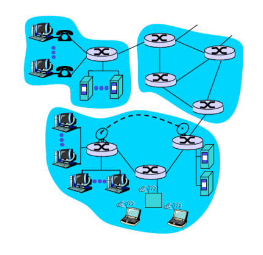
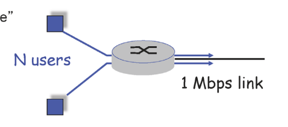

# 컴퓨터 네트워크 기본 1

## 🌐 인터넷의 구조
우리가 사용하는 인터넷은 사실 가장자리에 위치하고 그 가운데에는 라우터들이 존재한다.

### 인터넷의 구성 요소

- **Network Edge**: Applications and Hosts  
- **Network Core**: Routers

각각의 인터넷은 **유선 또는 무선 링크(link)** 로 연결되어 있다.

- end systems (hosts): 
    run application programs
    e.g. Web, email

- client/server model 
    client host requests, receives service from always-on server
    e.g. Web browser/server; email client/server

---

## 통신 service 방식

### TCP service가 제공하는

1. 연결 지향적(connection-oriented)
2. 신뢰성 있게 전달(메세지 유실되지 않음)
3. 보낸 순서를 지켜 서버로 전달 (전송 순서를 보장)
4. flow controll: data 전송 시 receiver의 속도와 중간의 네트워크의 흐름에 맞춰 sender가 전달

### UDP service가 제공하는

1. 비연결성(connectionless)
2. 신뢰성 없는 데이터 전송 (유실 가능)
3. 순서 보장 없음
4. 흐름 제어 없음, 혼잡 제어 없음

-> 보장해주는 것이 없다. 단지 빠르게 보낸다. 

---

## Protocal(프로토콜)
통신을 하기 위해 정해놓은 **약속 또는 규칙**이다.

## Network Core

라우터들이 위치하는 영역으로 

데이터를 전달하는 방식 2가지가 있다.

### circuit switching: 
출발지에서 목적지까지 가는 길을 예약하고 특정 사용자만을 위해 길을 만드는 것(일부 링크를 부여하는 것)

### packet switching: 
사용자가 보내는 data를 packet 단위로 담아 보내기 

인터넷은 왜 packet switching을 선택했는가?

 

예를 들어, 1Mbps 링크가 있다고 할 때:  

1. circuit switching 이라면 1Mbps link를 각 100kbps를 사용하면 10명의 사용자가 사용

2. packet switching 이라면 동시 사용자 수에 제한은 없지만, **혼잡**이 발생할 수 있다.

---

## packet switching의 loss와 delay

packet switching의 4가지 delay

1. 패킷을 받으면 패킷을 검사: nodal processing delay
2. 만약 que에 기존 패킷이 기다리고 있다면 대기: queuing delay
3. buffer에서 link로 전부 올리는데 걸리는 시간: transmission delay -> L/R (패킷 크기를 link bandwidth로 나눈값)
4. 다음 라우터까지 도달하는데 걸리는 시간: 마지막 비트가 올라간 후 전달되는 링크의 길이를 빛의 속도로 나눈것

그렇다면 delay를 줄여야하는데 

1. 은 좋은 라우터 사용하기 (하이패스 도입)
2. 조절이 가능한가? -> 조절하기 어렵다., 버퍼의 크기가 유한하니 패킷이 더 많이 들어오면 loss 유실이 일어남
3. 은 link의 bandwidth를 넓히기(케이블 공사, 4차로를 8차로로 증가)

## TCP는 신뢰성을 어떻게 보장하는가?

TCP는 data를 보장해 준다고 했는데 그렇다면? 

TCP는 **패킷 유실**이 발생하면 **재전송**을 수행한다.
이때 재전송은 **중간 라우터**가 아닌, **처음 전송자(sender)** 가 수행한다.   
네트워크 코어의 라우터들은 단순히 데이터를 **빠르게 전달**하는 데 집중한다.