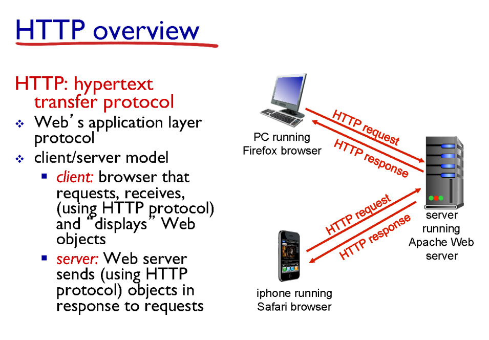

# 2.  컴퓨터네트워크 기본2

## 지난 시간

인터넷 전송 서비스 2가지
- TCP
- UDP

> 인터넷은 **패킷 기반 전송**

- 패킷들은 중간의 라우터를 통해 전달된다.
- 여러 패킷이 동시에 라우터에 도착하면 큐(queue)에 쌓이고 지연(delay)이 발생한다.
- 라우터의 버퍼 크기보다 많은 패킷이 들어오면 패킷 손실이 발생한다.
- 대부분의 손실은 라우터에서 발생하고, 링크에서는 드물다.

---

## Application Layer

앞으로 네트워크 계층에서의 유명한 프로토콜을 살펴본다

| 계층 | 이름         | 예시                              |
|------|--------------|-----------------------------------|
| 5    | Application  | HTTP                              |
| 4    | Transport    | TCP, UDP                          |
| 3    | Network      | IP                                |
| 2    | Link         | Wi-Fi(802.11), LTE, Ethernet      |
| 1    | Physical     | (물리 계층)                        |

application에는 process가 존재한다.

 중간의 네트워크가 어떻게 구성되는지 관심없음
 process간의 통신 
 (라우터에는 3-5계층만 존재함)

### Client-Server 구조

#### server: 
- 항상 켜저있고 
- 고정된 IP 주소를 갖아야 함

#### client
- 서버와 통신하는 host
- 동적인 IP 주소를 갖을 수 있다.
- 클라이언트끼리는 직접 통신하지 않는다.

프로세스를 찾기 위해서는 IP 주소와 Port 번호가 필요하다.
  
  많은 웹 서버가 포트 번호 80번을 사용함(naver,google 등..) 
 왜? 공통적으로 80번을 사용할까? => 
 IP 주소가 다 다르니 port번호를 공통되게 하자. 
 IP는 서로 다르기 때문에 포트를 통일하면 접근이 쉬워진다.

### Transport Layer에서 제공할길 기대하는 서비스

| 기능         | 설명                                                                 |
|--------------|----------------------------------------------------------------------|
| 데이터 무결성 | 손상 없이 정확하게 도착해야 함 (TCP 제공)                          |
| Throughput   | 초당 얼마나 많은 데이터를 보낼 수 있는지 (예: 영화 다운로드 속도)       |
| Timing       | 언제 도착하느냐 (예: 실시간 음성 통화 등)                             |
| 보안         | 암호화, 인증 등 (주로 다른 계층에서 처리)                             |

중 데이터 무결성만 제공해준다. (TCP가, UDP는 X)

### HTTP (HyperText Transfer Protocal)

하이퍼 텍스트를 전송 주고 받는 프로토콜
(메세지 전달 이전 TCP 연결이 필요하다.)

- HTTP는 무결성(stateless)이다.
요청을 들어오면 보내고 이 상태를 저장하지 않음, 상태를 저장하는 것은 복잡하다.

### HTTP 연결 방식

HTTP는 TCP 연결하는 것에 따라 2가지로 나뉜다.

#### Persistent HTTP
    TCP 연결을 끊지 않고 한번의 연결로 여러 객체를 보낼 수 있다. 

#### Non-Persistent HTTP
    한 객체당 한번의 TCP 연결이 필요
    즉, 여러 객체 요구시 여러번의 TCP 연결이 필요하다.
