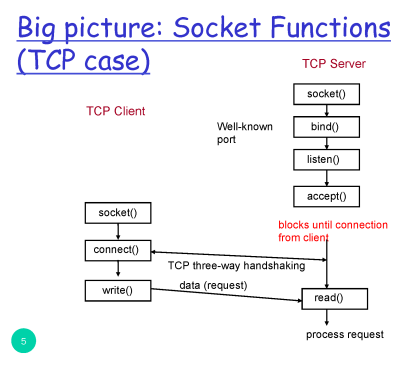
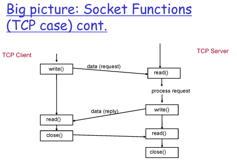
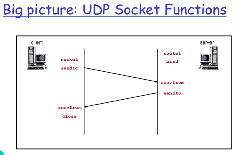
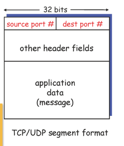
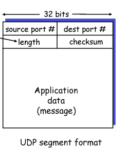

# 3. 애플리케이션 계층1

## What is Socket?

- Client process와 server process의 통신
- application과 network(OS) 간의 interface
  → application이 socket을 생성, 소켓의 type이 통신 방식을 결정
  reliable vs. best effort
  → 신뢰성 있는 방식 vs. 최선의 노력(best effort) 방식
  connection-oriented vs. connectionless
  → 연결 지향 방식 vs. 비연결 방식

## Socket의 종류

- TCP socket (SOCK_STREAM)
- UDP socket (SOCK_DGRAM)

## Socket API

### 웹서버 socket() 생성

→ bind(): 특정 포트에 socket을 bind
→ listen(): socket을 listen용도로 사용
→ accept(): client로부터 요청받을 준비 완료
→ block (client로부터 connection이 들어올 때까지)
→ Client에서 socket() 열고 connect()
→ TCP socket 둘 사이에 단단한 연결고리가 생성됨
→ write() → read() → 반복 → 다 끝나면 close()

## Multiplexing and Demultiplexing

- **Multiplexing**: 다중 socket으로부터 내려오는 데이터를 모아 그때그때마다 segment로 만들어 전달
- **Demultiplexing**: 받아온 segment를 알맞은 socket에 전달

### How demultiplexing Works

Segment : Data + Header(source port # + dest port # + other header fields)
Data 부분은 Header에 비해 엄청나게 큼

**source port, dest port**를 이용해 demultiplexing(demux)을 함

- UDP를 사용할 경우: dest IP, dest port #로 어떤 socket으로 올릴지 demultiplexing(demux)을 함 => 아무나 막 받을 수 있음

- TCP를 사용하는 경우: source IP, source port, dest IP, dest port로 socket으로 올릴지 demultiplexing(demux)을 함 => connection-oriented

- UDP가 제공: unreliable delivery, unorder delivery
  => 아무것도 안해주는 것 같지만 실제로는 transport Layer가 제공하는 기본적인 것들은 모두 제공해주고 있음

### UDP Segment header

header 부분 field 4개 => 그만큼 동작이 단순하다
→ source port, dest port, length, checksum
source port, dest port=> 각각 크기가 16bit (0 ~2^16-1), multi/demultiplexing을 할때 사용
length: 길이 / checksum: 전송 도중 에러 여부 판단
