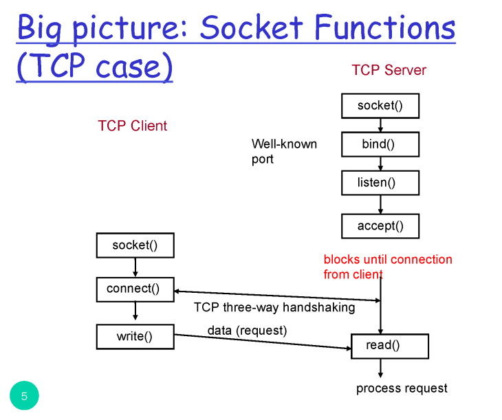
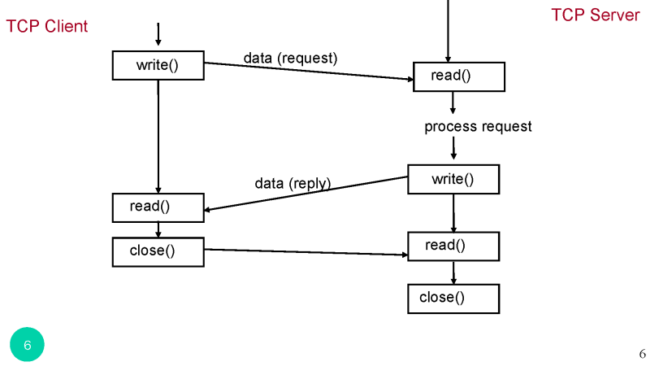
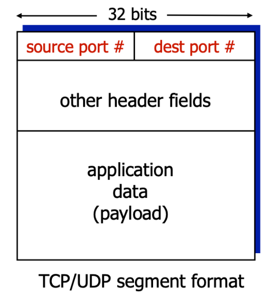

3.  애플리케이션계층1


- 개발자 입장(application)에서 os(transport)가 어떻게 구현되었는지는 모른다. os에서 제공하는 서비스를 사용할 뿐 이를 사용하기 위해선 인터페이스 사용해야한다.

- TCP / UDP 를 사용하기위해서 소켓을 이용해 각 제공되는 인터페이스를 사용한다.


 application layer 입장에서는 transport layer가 어떤지 알 필요없고 무슨 서비스를 제공하는지 

# socket 소켓

소켓(Socket) 은 네트워크 통신의 종단점(endpoint)이다.

애플리케이션은 소켓 인터페이스(API) 를 통해 TCP/UDP 통신을 사용한다.

소켓은 왜 필요한가?
 전송 계층이 제공하는 서비스를 사용하기 위한 추상화된 프로그래밍 인터페이스.
 프로그래머는 소켓을 통해 데이터 송수신, 연결 요청, 연결 종료 등의 네트워크 작업을 처리.

## SOCKET API 





---
### 1. 소켓 생성

``` int socket(int domain, int type, int protocol); ```


- domain: 주소 체계

   - AF_INET: IPv4

   - AF_INET6: IPv6

- type: 전송 방식

    - SOCK_STREAM: TCP

    - SOCK_DGRAM: UDP


---
### 2. 서버용 소켓 함수 흐름 (TCP)

``` socket() -> bind() -> listen() -> accept() -> read()/write()  ```

- socket(): 소켓 생성

- bind(): IP 주소와 포트번호 지정

- listen(): 클라이언트의 연결 요청 대기

- accept(): 연결 수락

- read()/write(): 데이터 송수신

---
### 3. 클라이언트용 소켓 함수 흐름 (TCP)

``` socket() -> connect() -> read()/write() ```
 
 client에서 bind()가 필요없는 이유는 그냥 남는 port로 보내면 되니 bind()롤 원하는 port 넣을 수도 있음

- connect(): 서버에 연결 요청

---

### 4. UDP 소켓 통신 흐름

- 연결 지향이 아님: connect() / accept() 필요 없음.

송신 : socket() → sendto()

수신: socket() → bind() → recvfrom()


---

### multpiplexing

- Application layer 에서 패킷이 소켓에 의해 Transport layer 로 전달 될 때, 여러 소켓의 패킷을 수집하여 하나의 세그먼트에 캡슐화하여 Network layer로 전달하는 과정

### Demultiplexing 

- Transport layer 에서 세그먼트가 Application layer 로 전달 될 때, 올바른 소켓으로 전달 하는 과정

- 어떻게 올바른 소켓으로 전달 할까? → 세그먼트의 헤더정보를 통해 전달

#### 동작



src port 번호와 dst port 번호를 가지고 Demultiplexing을 한다.

udp 사용 시 demultiplexing이 어떻게 이뤄지냐?
->  출처와 상관없이 dst ip와 dst port # 만을 사용해 어떤 소켓을 올릴지 demultiplexing이 이뤄진다.

tcp 사용 시에는 (Connection-oriented demux) 

dst ip + dst port # + src ip + src port # 을 이용해 Demultiplexing을 한다. 만약 4가지 중 1개라도 다르면 다른 소켓을 사용한다.

