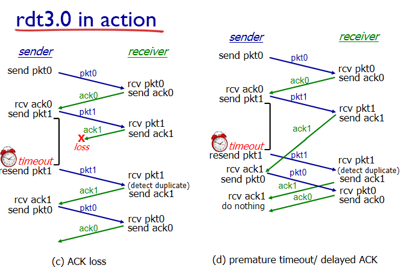
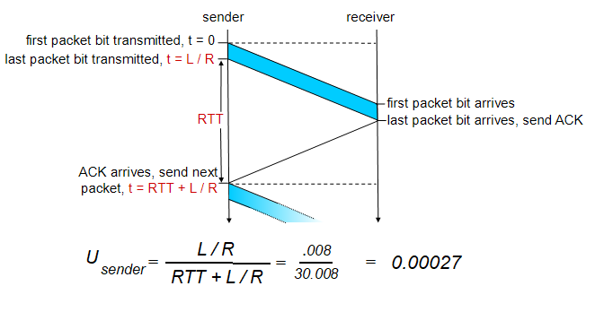

# 4. 애플리케이션 계층2

## reliable data transfer

- underlying network channel은 사실 unreliable함
  → unreliable하면 packet error or loss가 발생함

- **RDT protocol** : packet 하나 보내고 보낸거 확인되면 다시 보내고를 반복하는 protocol

- rdt v1.0 : underlying network channel이 완벽히 reliable하면? 딱히 할일이 없음
- rdt v2.0 : channel에 **packet error**가 있음
  → **checksum**으로 에러 탐지
  → receiver에서 에러를 확인하려면 **Feedback**이 필요 → 에러가 있으면 N(egative)ACKs, 정확하게 에러 없이 왔다면 ACKs
  → **Retransmission(재전송)**

=> 완벽히 error를 해결할 수 있는가? → ACK or NAK에 error가 있으면 받은 packet이 새로운건지/복제된건지 구별해야 함 → packet에 **sequence number**를 붙이면 해결이 가능 (rdt v2.1)
(※ seq #는 header에 들어감)

- rdt v3.0: error & loss
  → packet loss가 있을때 필요한 것 : **Timer**
  → packet을 보낼때 timer 실행시켜서 **timer 알람 울리면 loss 판단 후 재전송**
  => Timer를 얼마로 맞춰 놓을 것인가??
  → 시간이 짧으면: recovery가 빠름, 중복 packet 발생 / → timer가 길면: 중복 packet 발생 가능성이 낮음, loss 발생 반응이 느림
  
  

### 정리

**unreliable channel**이 있을 때 → **packet error, loss** 발생
**packet error**를 위해서는 → **error detection, feedback, retransmission, seq #** 필요
**packet loss**를 위해서는 → **Timeout** 필요

rdt v3.0의 performance
→ 한번에 하나밖에 못 보냄

Pipelined protocols
: 실제로 TCP가 동작하는 방식, packet을 여러개 묶어서 보냄

