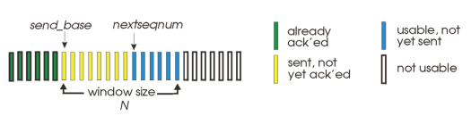
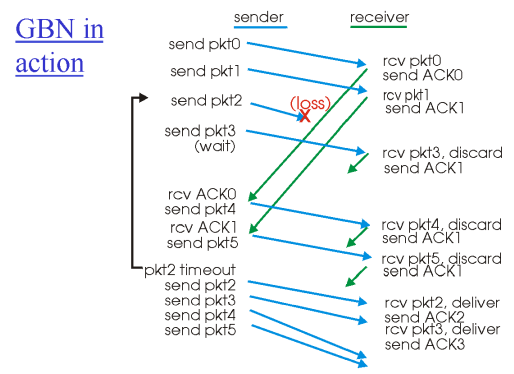

# 5. 전송계층1

rdt 3.0 ->  신뢰성 있는 통신을 보장하지만, 성능은 굉장히 안좋다

#### 성능을 확인하는 척도
**Utilization** : 전체 시간 중에서 sender가 네트워크를 사용하는 비율
→ 크면 클수록 좋음
(ex) 고속도로 4차선에서 1차선만 사용하는 것보다 4차선 전부 사용하는 게 더 좋음

rdt 3.0의 utilization → 0.00027 → 굉장히 비효율적 (packet을 보내고 feedback을 받을 때까지 sender가 아무 일도 안함, 한번에 하나씩만 보내고 나머지 시간은 아무것도 안하고 기다림)
→ 지향해야 하는건? 보낼때 몰아서 보내고 몰아서 받고
→ 우리가 사용하는 TCP는 pipelined protocols를 사용

pipelined protocol의 일반적인 형식: **go-Back-N, selective repeat**

**Go-Back-N**

go-Back-N이든, selective repeat이든, 한꺼번에 많은 packet을 쏟아 부음
-> 얼마나 많이 보낼것인가에 기준이 있어야 함 => **"window"**

window size만큼은 한꺼번에 feedback 받지 않고 보낼수 있음

- ACK -> cumulative ACK (누적 방식)
(ex) ACK11 -> "나 11번까지 하나도 빠지지 않고 다 잘 받음, 이제 12번 줘"

- receiver는 seq #만 기다림 
-> 1번을 기다리고 있는데, 다른 번호가 오면 버림 -> buffer 같은 저장 공간이 없기 때문

(+) window 안에 있는 것들은 버퍼에 저장해야 함 
=> window 안에 있는 것들은 receiver가 아직 받아갔는지 확인 못한 애들이기 때문

=> 유실된 거 때문에 재전송 해야하는 것들이 많아짐;; 

**Selective Repeat**
- 문제가 있을 때, **selective**하게 유실된 packet만 재전송을 해줌
=> ACK가 누적이 아니라 **individually**하게 바뀜 (ex) ACK7 => ACK 7번만을 선택

- receiver의 역할: 순서에 맞지 않게 들어온 packet이라도 저장을 해줘야 함
(ex) 2번을 기다리는데 3번이 들어옴 -> 3번을 buffer에 저장, 대신 ACK를 보내줘야 함

### 딜레마 
window size: 3, seq # : 0, 1, 2, 3 (4개)

패킷 번호(Sequence #)가 재사용되기 때문에, 수신자가 오래된 패킷과 새로운 패킷을 구분하지 못할 수 있는 딜레마가 발생

=> seq # 범위를 늘리면 딜레마 해결 가능

=> Sequence Number의 공간 ≥ 2 × 윈도우 크기
=> 동일한 번호의 패킷이 재사용되기 전까지 충분한 여유 간격 확보 가능
