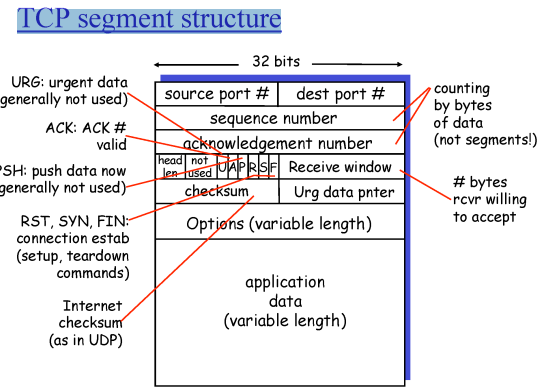

# 6.  전송계층2

## TCP

- point-to-point: 하나의 Process1와 Process2간의 통신(정확히는 소켓1과 소켓2간의 통신)
- reliable, in order(신뢰적, 순서)
- full duplex : 각각의 process들이 sender이며 receiver이다. 
- pipelined
- sender & receiver buffer, 각 window size만큼 전송, 받기
> sender : window size만큼 한번에 보내는데 유실된걸 재전송하려면 저장할 공간이 필요하다.
> recevier: out of packet 저장하기 위해, 뭘 받았는지 확인하기 위해
> 모두가 송신자이며 수신자이니 각각 sender,receiver window가 있다.

- connection-oriented
- flow control: receiver의 버퍼 크기에 맞게 보내는 것
- congestion control

---

## TCP segment structure

각 port # 는 0 ~ 2^16-1
checksum 에러가 있나 없나 확인하는 bit

seq num는 

만약 10바이트씩 나눠 보낼면 바이트의 순서 번호가
0~9번  10~19번 ... 이렇게 보낼텐데

그때의 segment의 seq는 data 제일 앞의 바이트 번호이다.
seq | ack | data
0   |     | 0,1,2,3,4,5,6,7,8,9
10  |     | 10,...      19

또한 TCP에서 ack은 cumulative ack이다. -> (GBN과 달리) ACK 10은 9까지 다 받았다.  

---
(TCP에서 receiver는 sender이기도 하다 그래서 실제로 패킷을 받고 바로 ㅇㅋ를 보내지 않고 대략 500ms정도는 기다린다.
1. 답신용으로 보내기 보다 조금 기다렸다가 보낼 데이터가 있다면 같이 보내면 더 효율적이니
2. sender가 하나의 패킷을 보내지 않고 여러 패킷을 한번에 보냄 이때 TCP의 ack은 cumulative ack이다 그러니 하나하나의 패킷에 ack을 보내는 것 보다 마지막 ack을 보내는 것이 좋다
)

---

중간의 패킷이 유실된 걸 확인하는 방법은 
Timeout

시간을 어느정도로 해야할까? 적당히 잡기 
RTT보다 더 시간이 걸리면 유실이다로 판단?

하지만 RTT가 모두 같지 않음 (경로가 다르니, 경로가 같아도 각 라우터들의 queuing delay에 따라 다르다)

따라서 SampleRTT을 찾아보자

EstimatedRTT = (1- a) *EstimatedRTT + a*SampleRTT (보통 a = 0.125)

DevRTT = (1-ẞ) *DevRTT + B*| SampleRTT-EstimatedRTT| (typically, ẞ = 0.25)

여기서 중요한건 timeout을 잡되, 어느정도 마진을 잡아준다.

---

