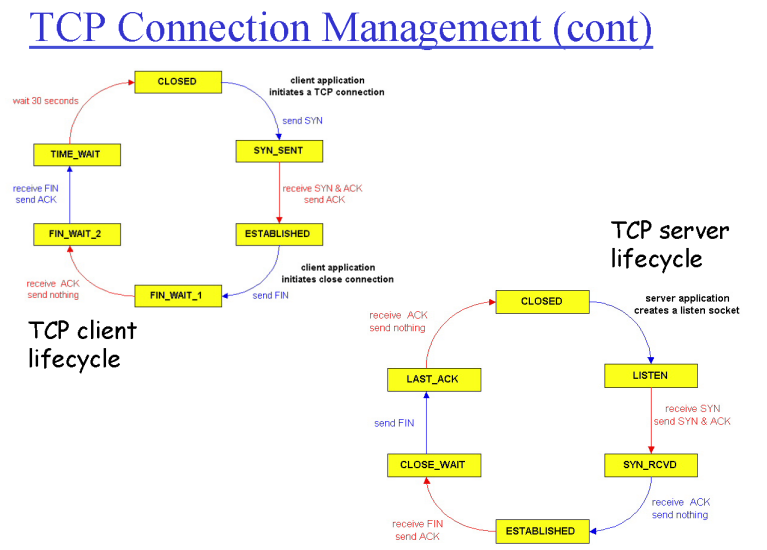

# 7. 전송계층3

## Flow Control
- 수신자가 처리할 수 있는 양만큼 송신자가 데이터를 보내도록 조절
- 송신자는 너무 많이, 너무 빨리 전송하여 수신자의 버퍼를 오버플로우하지 않게 함

---
## 어떻게 flow control이 작동하는가?

총 버퍼 크기: RcvBuffer
남은 공간 (spare room) = RcvWindow → 수신자가 버퍼에 더 받을 수 있는 양
현재 수신한 데이터의 양: LastByteRcvd - LastByteRead
"RcvWindow = RcvBuffer - (LastByteRcvd - LastByteRead)"

=> 수신자가 송신자에게 수신 버퍼의 여유 공간을 RcvWindow로 알려주고, 이 값을 기준으로 송신자가 전송량을 조절해서 수신자의 오버플로우를 방지함

---
## Connection management

- 양쪽(A,B)에서 데이터를 주고받을때, 결국 필요한 구조체는 양쪽 sender&receiver buffer와 내가 보낸 데이터들의 seq #, 상대방의 seq #가 필요

- 3-way handshake
TCP sender, receiver는 데이터 segment를 교환하기 전에 **연결**을 설정
TCP 변수를 초기화 -> 시퀀스 번호, 버퍼, 흐름 제어 정보 (ex: RcvWindow)
client는 연결 시작자, server는 client가 접속

**작동 방식**
1. client가 server에 먼저 TCP connection을 열고 싶다는 의사 표현을 함 (TCP SYN을 보냄)
2. server가 SYN을 받고, SYN-ACK segment과 함께 응답을 함
3. client가 SYN-ACK를 받고, data를 포함할 수 있는 ACK segment를 응답

- Closing TCP Connection
1. client end system이 TCP FIN 제어 세그먼트를 서버에 보냄
2. 서버가 FIN을 받고, ACK 응답함, 연결을 종료하고 FIN을 보냄
3. client가 FIN을 받고 ACK 응답, 이후 timed wait 상태에 들어감
4. 서버가 ACK을 받고, 연결 종료

- TCP Connection Management의 lifecycle

---
## Principles of congestion control (혼잡 제어)

접근 방식
1. End-end congestion control
- network로부터 명시된 feedback이 없음
- end system에서 관찰된 loss, delay에 의해 혼잡이 추론됨
- ТСР에서 취한 접근 방식

2. Network-assisted congestion control
- 라우터가 end system에 feedback을 제공
	- 혼잡을 야기하는 single bit(ex: SNA. DECbit, TCP/IP ECN, ATM)
	- 발신자가 보내야 하는 명시적 속도
