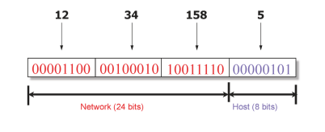
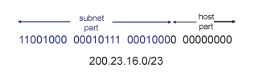

# 10. 네트워크계층2

## IP datagram format
- source IP address: 메시지를 생성해서 보내는 사람의 IP주소
- destination IP address: 최종 목적지 host의 IP주소
- time to live(TTL): 패킷이 네트워크에서 영원히 돌아다니는 것을 방지

=> 컴퓨터가 TTL = 64로 설정해 패킷을 보냄 → 패킷이 라우터 1대를 통과 → TTL = 63 → 라우터를 64번 지나면 TTL = 0 

- Upper Layer: data 부분에 들어가는 segment가 TCP인지 UDP인지를 명시

---
## IP Address (IPv4)
- 32-bit number 주소 체계 (8bit로 나눠서 10진수로 표현 -> ex) 192.168.0.1)
- host/router 등에 들어있는 interface를 식별하기 위해 사용
- 점선 사분면 표기법으로 나타남

---
## Grouping Related Hosts (관련 호스트 그룹화)
- 인터넷은 inter-network, 즉 네트워크들의 네트워크임
	- host를 직접 연결하는 게 아니라, 여러 네트워크를 서로 연결
	- 네트워크 주소 지정이 필요함
- LAN(Local Area Network): 여러 host들이 연결된 소규모 네트워크
- WAN(Wide Area Network): 라우터들을 통해 LAN들을 연결하는 더 넓은 범위의 네트워크
- 라우터: 서로 다른 네트워크를 연결, IP 주소 기반 포워딩/라우팅을 수행

※ 왜 네트워크 단위로 주소 지정?

- 예를 들어, 192.168.1.0/24 네트워크에서 192.168.1.xxx 부분은 네트워크 주소를 나타냄
- IP 주소의 뒷부분(xxx)은 해당 네트워크 내에서 특정 장치를 식별하는 주소

=> 이러한 구조 덕에 전체 주소를 다 알 필요 없이, 어느 네트워크로 가는지만 알면 됨

=> 네트워크 단위로 호스트를 그룹화해서 효율적 라우팅이 가능함!

### Scalability Challenge (확장성 문제)
임의로 IP 주소 배정을 하면,  host 별로 방향이 다 틀리기 때문에 모든 정보를 다 알아야 함

=> 라우터 안에 들어있는 forwarding table이 엄청나게 커짐

=> 확장성 문제 발생

### Hierarchical Addressing: IP Prefixes (계층적 주소 지정: IP 접두사)

현재의 IP 주소는 계층화를 시켜 놓음 (32bit를 두 부분으로 나눠 놓음)

- IP 주소는 32비트 = [네트워크 부분 | 호스트 부분]
- 앞 부분은 네트워크 id, 뒷부분은 네트워크에 속한 host id

### IP Address and 24-bit Subnet Mask

Subnet Mask: IP 주소를 네트워크 주소와 호스트 주소로 나누기 위한 비트 마스크
	- 어디까지가 네트워크고, 어디서부터가 호스트인지 구분해줌
	- 형태: 255.255.255.0 or /24
- 결과적으로 서브넷 마스크를 사용하게 되면

=> Scalability Improved (확장성 개선) : 포워딩 테이블만 단순화 해줄 뿐만 아니라, 새로운 호스트를 추가해 IP 주소를 맘대로 줄 수 있음

=> Easy to Add New Hosts : 라우터의 포워딩 테이블은 변경할 필요 없기에 새 호스트 추가가 쉬움

(host 아이디만 다르고 network는 같음)

---

인터넷 = 네트워크들의 집합 ( 인터넷의 구성요소는 네트워크임)

=> 그러면 네트워크들은 자기 자신의 prefix를 가져야 함. 각각의 prefix의 크기는 다 다름

### Classful Addressing
- 과거, IP주소 자체를 class로 나눠 놓음 (고정된 할당 크기로)
	- class A : /8 => 2^24 blocks
	- class B: /16 => 2^16 blocks 
	- class C: /24 => 2^8 blocks
- 과거에는 서브넷 크기가 고정되어 있어 낭비가 심했음
	- 네트워크 라우터 안의 포워딩 테이블 크기가 컸음
	- 작은 회사도 Class B를 할당받아야 했다면 대부분의 IP가 미사용 상태
- 그래서 사람들이 **도트 4개로 나눈 IPv4 표현(dotted-quad)**을 사용하게 되었음

---
## Classless Inter-Domain Routing (CIDR)
- class가 없는 개념의 주소 공간 배정 방식
	- IP 주소를 IP + 마스크 형식으로 표현
		- 상위 15bit는 네트워크 주소, 나머지는 호스트 구분용
- 더이상 8bit단위로 끊어지는게 아니라 자유로운 단위(필요한 갯수만큼)로 prefix가 끊어짐
- 과거 class 기반 방식에 비해 주소 낭비 감소
	- 필요한 만큼의 주소만 정확하게 할당할 수 있기 때문

---
## Separate Forwarding Entry Per Prefix
- prefix-기반 포워딩
	- 목적지 주소를 일치하는 prefix에 매핑
	- 발신 인터페이스로 전달

### Longest Prefix Match Forwarding
- 목적지 기반 포워딩
	- 패킷이 destination 주소를 가짐
	- 라우터가 가장 일치하는(longest matching) prefix를 식별
	- 귀여운 알고리즘 문제: 매우 빠른 조회

---
## IP addressing: CIDR
CIDR: 고정된 클래스(Class A, B, C)에 의존하지 않고, 임의의 길이로 서브넷을 나누는 방식

- 서브넷 부분의 길이를 자유롭게(x비트) 설정 가능
	- 예: /23이면 앞 23비트가 네트워크 주소, 나머지 9비트는 호스트
- address format: a.b.c.d/x
	- x는 서브넷 부분의 비트 수를 나타냄
	- 예: 200.23.16.0/23 → 앞 23비트가 네트워크 주소

### Subnets
- IP address
	- Subnet part (서브넷 부분): 상위 비트 (High-order bits)
	- Host part (호스트 부분): 하위 비트 (Low-order bits)
- 서브넷이 무엇인가?
	- 같은 서브넷 주소를 가지는 디바이스들
	- 라우터를 거치지 않고 통신 가능

---
## NATs의 역사
- IP 주소 공간 고갈
	- IPv4는 32bit 주소 체계 사용, 약 43억개의 IP 주소 제공
	- 1990년대 초, 인터넷 사용 급증으로 인해 IP 주소 부족 문제가 명확해짐
- IPv6라는 차세대 프로토콜의 개발이 시작됨 (128비트 주소).
	- IPv6의 보급에는 시간이 걸렸기 때문에, 그 공백을 메울 임시 해결책이 필요	
- **NAT(Network Address Translation)**는 기존 IPv4 구조를 바꾸지 않고 하나의 공인 IP 주소를 여러 기기가 공유할 수 있게 해줌.
- 원래는 단기적인 임시방편으로 설계된 NAT이지만, 이제는 전 세계적으로 폭넓게 배포되어 IPv6보다 훨씬 더 보편화됨

---
## Network Address Translation (NAT, 네트워크 주소 변환)

- 컴퓨터 네트워킹에서 쓰이는 용어로, IP 패킷의 TCP/UDP 포트 #와 소스 및 목적지의 

IP주소 등을 재기록하면서 라우터를 통해 네트워크 트래픽을 주고 받는 기술
- NAT은 IP 주소를 재 작성함
	- "내부"를 단일 IP 주소처럼 보이게 만들기
	- 헤더 체크섬을 적절히 변경
	- Outbound: src IP 주소 재작성
	- Inbound: dest IP 주소 재작성