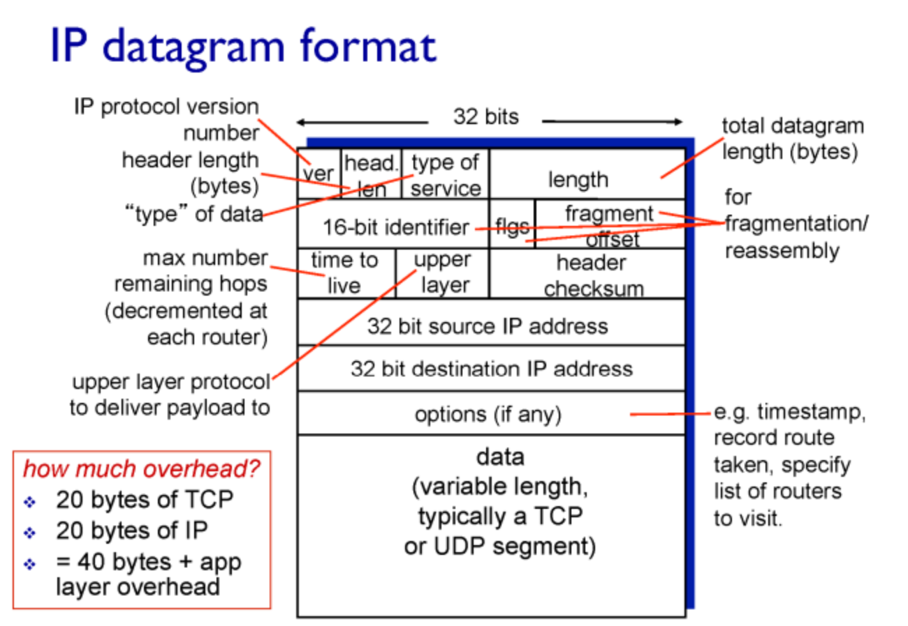

# 네트워크 2

## IP (Internet Protocol)

버전 4 ipv4의 datagram format이다.

- ver: IP 버전 (IPv4)
- length, checksum: 헤더 길이 및 오류 검출용 체크섬
- TTL(Time to Live): 각 라우터를 지날 때마다 1씩 감소. 0이 되면 폐기됨  
(네트워크 상 라우팅 테이블이 잘못되었을 경우 루프를 돌수 있는다. 이게 없으면 계속 루프도니 한정 시간을 정해준다.)

- upper layer: 데이터 부분에 들어가는 게 TCP 인지 UDP인지 receiver 측이 확인하기 위함
- src ip addr, dst ip addr

> 기본적으로 IP 헤더 20바이트, TCP 헤더 20바이트 →  메세지(application 메세지)에 총 40바이트의 오버헤드가 덧붙여 전송된다.
> 일부 패킷은 데이터 없이 헤더만 존재 (예: TCP ACK, 5바이트)

---

- IPv4의 ip addr는 32bit 주소 체계를 갖는다. 2^32개의 주소를 가질 수 있는것이다.
- IP 주소는 **호스트의 네트워크 인터페이스를 식별**하는 주소
- 하나의 호스트가 여러 IP 주소를 가질 수 있음 (여러 NIC 장착 시)

## ip 주소의 계층화

32bit 공간을 두 부분으로 개념상으로 나눠놨다

| Network ID (24bit)                             | Host ID (8bit)   |
|------------------------------------------------|------------------|
| `00001100` `00100001` `01001111`               | `00000101`       |

- Network ID: 같은 네트워크에 속한 host들이 공유하는 부분
- Host ID: 해당 네트워크 내의 개별 host 식별

> network ID는 앞에 나온다고 해서 prefix라고도 부른다 
> network ID == subnet ID == prefix

## Subnet Mask

네트워크 ID와 호스트 ID의 경계를 구분하기 위해 사용
 이 주소중에서 어디까지가 subnetID(NetworkID)인지

이 둘은 항상 같이 다닌다. 어디까지가 네트워크ID인지 표시해줘야 되니까. 
그리고 이걸로 네트워크의 크기를 알 수 있다.

- IP 주소: `192.168.200.111`
- Subnet Mask: `255.255.255.0` → `/24` (앞 24비트가 네트워크 ID)

그래서 prefix 방식으로 구성하면 같은 네트워크에 속한 host들이 같은 prefix이니 forwarding table이 단순해 진다.

## Classful Addressing (클래스 기반 주소 할당)

초기에는 고정된 Prefix 길이에 따라 주소를 클래스별로 구분

Class A(/8) | Class B(/16) | Class C(/24)
| 클래스 | Prefix 길이 |  호스트 수 |
|--------|-------------|------------|
| A      | /8          | 2²⁴개      |
| B      | /16         | 2¹⁶개      |
| C      | /24         | 2⁸개       |

> 문제점: 네트워크 크기에 비해 주소 낭비 발생 (너무 크거나 작음 -> 유연하지 않음)

그래서 1990년대 중반에 class개념 없애고 나온게 싸이더 CIDR

## CIDR (Classless Inter-Domain Routing)

더이상 8비트단위로 prefix가 끊어지는게 아니라 자유롭게 끊어진다 /15같은게 가능해짐

이제 host 1000개 필요하면 C클래스 4개 받는게 아니고
/22받으면 1024개 까지 가능한것

> CIDR 도입으로 prefix도 하나로 바뀌고 forwarding table크기도 줄어듦. 이로 네트워크 주소 할당이 유연해지고, 인터넷 라우팅 구조가 개선됨