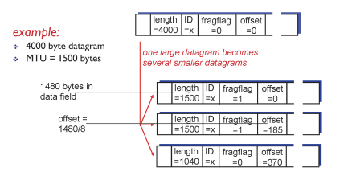

# 11. 네트워크계층3


## Principled Objections Against NAT (NAT에 대한 원칙적 비판)
1. 라우터는 IP 헤더만 보고 동작해야 하고, 전송 게층의 포트 번호를 들여봐서는 안된다.
2. NAT는 end to end 논쟁을 위반한다.
	- 네트워크 노드는 패킷을 수정해서는 안된다.
3. IPv6는 더 깨끗한 해결책이다.
	- IPv4의 근본적 문제점: 주소 공간 부족 문제, 보안 문제
	- IPv6로의 전환을 통해 인터넷을 정비해야 할 시점이다.(해킹에 대비해 이주해야 한다)

## Dynamic Host Configuration Protocol(DHCP, 동적 호스트 구성 프로토콜)

- 서버에서 주소를 동적으로 가져옴
	- plug and play(장치를 연결하면, 자동으로 인식되고 동작하도록 만드는 기술)
- 목표: 호스트가 네트워크에 가입할 때 네트워크 서버로부터 IP 주소를 동적으로 가져올 수 있도록 허용
	- 사용중인 주소 임대를 갱신할 수 있음
	- 주소 재사용을 허용(연결된 상태에서 주소만 유지 / "ON")
	- 네트워크에 참여하고 싶은 모바일 유저를 위한 지원 (간단히? 짧게?)
- 개요:
	- DHCP discover: 호스트가 브로드캐스트로 DHCP 서버를 찾음 (optional)
	- DHCP offer: DHCP 서버가 사용 가능한 IP 주소와 기타 설정을 제안 (optional)
	- DHCP request: 호스트가 특정 DHCP 서버의 제안을 수락하고, 해당 IP를 요청
	- DHCP ACK: 서버가 해당 IP를 정식으로 할당하고 기타 네트워크 설정 정보를 전송


### DHCP client-server scenario (간단 요약)


```
	[Host/Client]         →        DHCP discover (broadcast)   [Optional] 
	[DHCP Server]  	  →        DHCP offer                        [Optional]
	[Host/Client]         →        DHCP request
	[DHCP Server]       →        DHCP ACK (address assigned)
```


## DHCP 예시

- laptop을 연결하기 위해서는 자체의 IP 주소, first-hop router의 주소, DNS 서버의 주소(DHCP 사용)
- DHCP request는 UDP 안에, IP 안에, Ethernet 802.1 안에 캡슐화되어 있음
- LAN에서의 Ethernet frame broadcast는 DHCP 서버를 실행하는 라우터에서 수신됨
- DCP 서버는 클라이언트와 클라이언트용 퍼스트 홉 라우터의 IP 주소, DNS 서버의 이름 및 IP 주소를 포함하는 DHCP ACK를 공식화함
- DHCP 서버 캡슐화, 클라이언트로 프레임 전달, 클라이언트에서 DHCP까지 demuxing
- 클라이언트는 자신의 IP 주소, 이름, 그리고 DNS서버의 IP주소, first-hop router의 IP 주소를 알고 있음


## IP fragmentation, reassembly (IP 단편화, 재조립)

- 네트워크 링크들은 MTU(max.transfer size - 가능한 최대 링크 수준 프레임)를 가짐
	- 다른 링크 종류, 다른 MTUs
- net 내에서 분할된 대규모 IP datagram
	- 한 데이터그램은 세부 데이터그램들이 됨
	- 마지막 목적지에서 재조합됨
	- IP header bit는 관련 fragments을 식별하고 정렬하는 데 사용됨
- 예시




