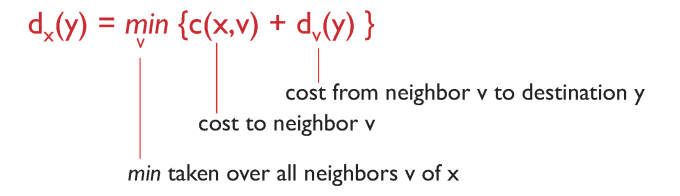

# 12. 네트워크계층4
## ICMP (internet control message protocol)

- 호스트와 라우터가 네트워크 수준 정보를 전달하는 데 사용
	- 에러 보고 (도달할 수 없는 호스트, 네트워크, 포트, 프로토콜)
	- echo request/reply (핑에 의해 사용됨)
- 네트워크 계층 "위" IP:
	- IP 데이터그램으로 전송되는 ICMP 메시지
- ICMP 메시지: 타입, 코드, 첫 8바이트의 IP 데이터그램이 오류를 일으킵니다

---
## IPv6 format

가장 큰 특징? address space가 128 bit임 => address space 문제는 걱정 안해도 된다

---
## Transition from IPv4 to IPv6

- 모든 라우터를 동시에 업그레이드할 수 없음
	- flag day (한순간에 전체 변경)은 현실적으로 불가능
	- IPv4와 IPv6 라우터가 혼합된 환경에서 어떻게 통신하는가?
- 해결책: Tunneling
	- IPv6 패킷을 IPv4 패킷 안에 탑승시켜 전송하는 방식
	- IPv6 패킷을 전체 그대로 보존한 채, IPv4 패킷의 페이로드(payload)로 캡슐화(encapsulation)하여 전송
	- IPv4 라우터들은 이 패킷을 IPv4 패킷으로만 인식함 → 중간 라우터들이 IPv6를 몰라도 전달 가능

---
## 라우팅, 포워딩 사이의 상호 작용
- 라우팅 알고리즘은 네트워크를 통한 end-end 경로를 결정
- 포워딩 테이블은 이 라우터에서 로컬 포워딩을 결정

---
## Graph abstraction

> 노드 = 라우터, edge = link, 노드 사이의 값들 = cost

목적: 최소 비용을 찾는 것

### Routing algorithm classification (라우팅 알고리즘 분류)
1. Global(link-state 알고리즘) vs Decentralized(distance vector 알고리즘)
- 전체 네트워크의 완전한 토폴로지를 알고 있음 vs 이웃 노드와의 거리 정보만 알고 있음
2. static vs dynamic
- 경로가 수동 설정되고 변화가 X vs 네트워크 상황에 따라 동적으로 경로 자동 계산

---
## Dijkstra's algorithm (Link-State Routing Algorithm)
- 모든 노드에 알려진 net topology, 링크 비용
	- link state broadcast를 통해 달성되고
	- 모든 노드가 닽은 info를 가지고 있다.
- 하나의 source 노드에서 다른 모든 노드까지의 최소 비용 경로 계산
	- 그 노드의 Forwarding Table (전달 테이블) 생성
- 반복적(iterative) 알고리즘으로
	- k번째 반복 후, k개 목적지까지의 최소 비용 경로를 확정

-  표기법
| 기호		| 의미										                              |
|---------|-----------------------------------------------------|
| c(x, y)	| 노드 x와 y 사이의 링크 비용 (연결 안 되어 있으면 = ∞)	  |
| D(v)		| source → v까지 알려진 현재 최소 비용 (계산 중)		      |
| p(v)		| v까지 가는 경로에서 v의 직전 노드 (경로 추적용)		      |
| N'		  | 최소 비용 경로가 확정된 노드들의 집합 (방문 노드 집합)	|

### Dijsktra's Algorithm pseudocode

- 초기화 단계
	- 시작 노드 u를 선택, N' = {u} 초기화
	- D(v) = c(u,v) 또는 ∞
- 루프 단계(모든 노드가 N'에 포함될 때까지)
	- N'에 포함되지 않은 노드 중 D(w)가 최소인 w 선택
	- w를 N'에 추가
	-  w의 인접 노드 v 중 N'에 없는 노드에 대해 D(v) = min(D(v), D(w) + c(w,v))로 갱신
	- 루프 반복, 모든 노드의 최단 거리가 확정되면 종료

- 예시

### discussion
- algorithm complexity(알고리즘 복잡도): n nodes
	- 각 반복시에, N이 아닌 모든 노드 w를 확인해야 함
	- n(n+1)/2 comparisons: O(n²)
	- 더 효율적으로 구현할 수 있으면: O(nlogn)
- oscillations possible(진동 가능성):
	- 지원 링크 비용은 운반된 트래픽의 양과 같다
	- 한 번 방문한 노드는 다시 방문하지 않음 + 최단 거리가 확정되면 갱신하지 않음
	- + 음의 가중치가 없기 떄문에 항상 단조롭게 거리를 확정하기 때문에 진동이 없음

> **진동(oscillation)**은 어떤 값이 일정하지 않고 왔다 갔다 반복되는 현상을 의미

---
## Distance vector algorithms

- Bellman-Ford 방정식 (dynamic programming)
	- 정의 dx(y) := 노드 x에서 목적지 y까지의 최소 비용 경로의 비용
	- 수식 

> c(x,v): x에서 인접 노드 v까지 가는 비용
> dv(y): 인접 노드 v에서 목적지 y까지의 최소 비용
> minv: x의 모든 인접 노드 v에 대해 최소값을 구함