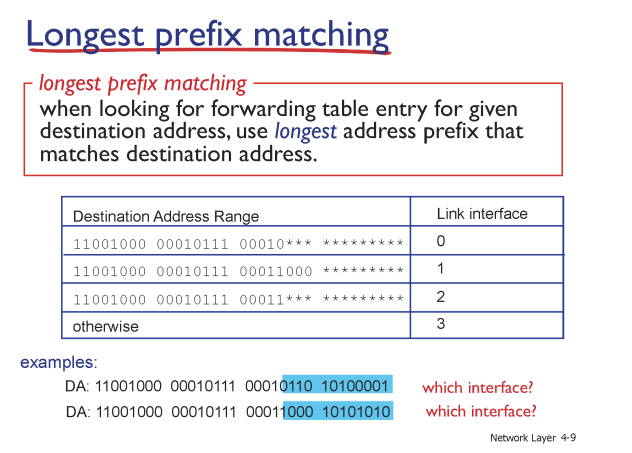

# 9. 네트워크계층1

## Network Layer

- 전송계층에서 받은 세그먼트를 수신(destination) host까지 전송
	- 세그먼트를 데이터그램 형태로 목적지에 전달
- 송신(sending side): 세그먼트를 받아서 데이터그램으로 캡슐화
	- 세그먼트에 IP 헤더를 붙여 IP 데이터그램을 만듦
- 수신(receiving side): 세그먼트를 전송 계층으로 전달
	- 이때 IP 헤더를 제거하고, TCP/UDP 등 상위 전송 계층으로 잔달
- 모든 host, 라우터(즉, 모든 인터넷 장치)에 네트워크 계층 프로토콜이 있음
- 라우터는 header 필드를 통과하는 모든 IP 데이터그램에서 header 필드를 검사함

---
## 라우터에서 하는일 

1. **forwarding**: 라우터에서 input 포트로 들어온 패킷을 올바른 output 포트로 이동시키는 작업
	- 들어온 패킷의 목적지 주소와 테이블의 entry를 매칭시켜서 해당하는 링크로 포워딩한다.
	- ex) 고속도로에서 나들목(interchange)를 통과하는 과정

2. **routing**: 패킷이 출발지에서 목적지까지 어떤 route를 따라 갈지를 결정하는 과정
	- 이 과정에서 라우팅 알고리즘을 사용
	- ex) 여행계획 세우기

---
## routing과 forwarding 간의 상호작용

패킷이 들어오면 그 패킷을 목적지로 향하는 방향으로 전달한다 -> 핵심적인 일

=> 목적지 & 목적지로 향하는 길을 판단해야 함

=> 라우터 안의 표, forwarding table을 참고해 라우터가 패킷을 어느 목적지로 보낼지를 결정

ex) 들어온 packet의 header가 0111

forwarding table에서 header value가 0111인 부분을 찾고 해당되는 output link가 2라면, packet을 2번 목적지로 보냄

※ forwarding table은 어떻게 만들어지는가?
ⅰ. 라우팅 알고리즘이 네트워크 전체의 최적 경로를 계산해 라우팅 테이블에 저장
ⅱ.  운영체제가 라우팅 테이블에서 필요한 정보만 추출해 포워딩 테이블을 생성

---
## Datagram Network (데이터그램 네트워크)
- 네트워크 계층에서는 연결 설정(call setup)이 없음
	- 전송하기 전에 미리 경로나 연결을 잡지 않는다
- 라우터는 end to end 연결에 대한 상태를 저장하지 않음
	- 네트워크 계층은 TCP 같은 연결 개념을 가지지 않는다
- 대상 호스트 주소를 사용하여 전달된 패킷
	- 각 패킷이 독립적으로 전송되고, 목적지 IP 주소를 기준으로 라우터가 경로를 결정함

---
## Datagram forwarding table(데이터그램 포워딩 테이블)

IPv4기준 전세계에 약 40억개의 IP주소가 존재

-> 모든 주소를 개별적으로 나열하는 것은 굉장히 비효율적임.

-> 그렇기에 포워딩 테이블은 **주소 범위**로 요약된 형태로 작성이 되고 관리됨

-> Ex) 주소 O번 ~ O번까지는 A로, 다른 부분은 B로...

---
## Longest prefix matching 
- 라우터 안에 들어있는 forwarding table의 예시
- 목적지 IP 주소에 대해 포워딩 테이블을 검색할 때, 일치하는 주소 범위 중 

가장 긴 접두사(prefix)를 가진 항목을 선택하는 것.

앞 부분(주소 부분, Destination Address Range)은 bit으로 표현

interface 선택시 동일한 interface가 있을 때, 가장 구체적으로 많은 bit를 가진 interface를 선택