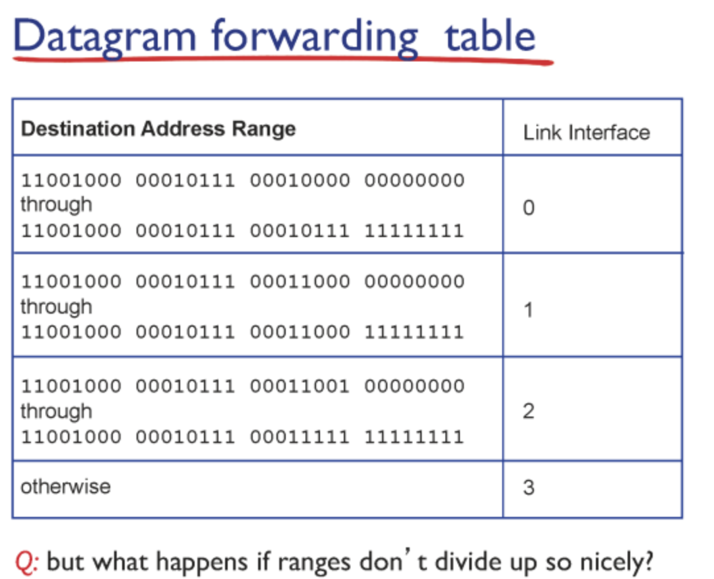

# 네트워크 1 - Network Layer

- Application Layer, Transport Layer 입장에서 보면 그냥 알아서 패킷을 잘 싸서 보내진다 로 생각한다.
- 실제로는 **TCP segment**를 목적지까지 **어떤 경로로 보낼지 결정**을 network layer에서 한다.
- Network Layer에서는 **IP 프로토콜** 중심으로 배송에 관한 일을 관장한다.

## 라우터(Router)의 역할

라우터는 딱 2가지의 일을한다.

1. forwarding: 보내기
2. routing: planning 하기 (경로 설정)

라우터는 패킷이 들어오면 해당 패킷 목적지로 향하는 방향으로 전달

어떻게 하냐?

## 포워딩(Forwarding)

- **포워딩 테이블(Forwarding Table)** 을 기반으로 패킷을 전달

- 과정:
  1. 패킷의 헤더에서 **목적지 주소**를 확인
  2. **포워딩 테이블을 참조**
  3. 알맞은 방향(포트)으로 **전송**

## 라우팅(Routing)

forwarding table은 누가 만들어 라우터가 몇개인디
이를 라우팅 알고리즘이 하는 일이다.

라우팅: 포워딩 테이블을 만들어 주는 일을 한다.
포워딩: 포워딩 테이블을 참조해 전달

## 포워딩 테이블 구성 방식

포워딩 테이블은 현실 주소 처럼 도/시/동 나눠서 관리

- 예: 도/시/동  
- 네트워크에서는: `/8`, `/16`, `/24` 형태로 주소 블록을 표현
- 이를 통해 **효율적인 검색 및 경로 결정** 가능

